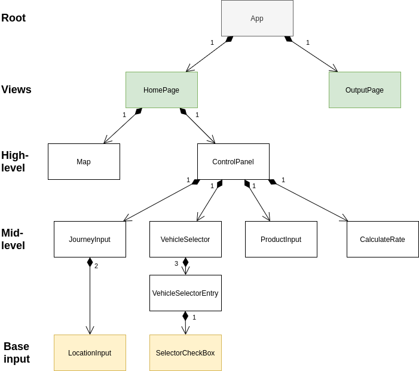

# Architecture document

<!-- The goal of this document is to allow you to present the architecture of what you have already but also what you are aiming at. (e.g. if you plan to use Angular on the front-end, but didn’t start using it yet, do mention this). One of the goals of this document is to make sure that the SE Staff has a good overview of what everybody is doing so we can offer you the best advice :)
-->

<!-- A nice cover:...will make the us happy. Add the project title, the client, the team names, TA name and the document version.
-->
<b>Sharing Logistics Simulation</b>

<i>Client: Astone Shi</i>

Version 1.0

Team:       Antonin Thioux, Bjar Karim, Gheorghe Pojoga, Lonneke Pulles & Lorenzo La Rocca

Under supervision of Alex Tutea

## Introduction
<!-- A brief introduction to the product, highlighting the specifics that influence the architecture and design choices.-->

The product will be a web application that is simulating the effect that sharing 
space for goods would have. The application's main goal is to determine if it
would be a worthwhile idea to set up a platform on which companies or truck owners
could offer empty space to transport other people's goods.

Since the simulation does not depend on persistent data, this web application is designed
without a database or backend. Moreover, to simplify the simulation in first instance,
only the start and end location of a trip can be entered.


## Architectural overview
<!-- Architectural overview: What components are there and what are their functions?How are components connected/communicating?If a more general principle or a paradigm is applied that is worth mentioning, mention it.-->

The project does not need a persistent database, because all simulated data will be calculated on the spot. This means that
here is no backend and the frontend makes up the entire application.

The application is mainly created with Vue.js. This is a lightweight and open source
Javascript framework that mainly focuses on simplifying the creation of a dynamic Single Page Application.

<!-- Create nice schema to clarify architecture! -->

````
├── public
│   └── index.html
└── src
    ├── main.js                         # renders and mounts the app
    ├── App.vue                         # the root of the app
    ├── components
    │   ├── App.vue                     # the root of the app
    │   ├── ControlPanel.vue            # the panel on the left of the screen that handles the input
    │   ├── ControlPanelOutput.vue
    │   ├── DateInput.vue               # base input component for dates
    │   ├── JourneyInput.vue
    │   ├── LocationInput.vue           # base input component for locations
    │   ├── Map.vue
    │   ├── ProductInput.vue            # input component for the goods
    │   ├── SelectorCheckBox.vue        # base input component for a checkbox
    │   ├── VehicleSelector.vue         # input component for all vehicle types
    │   └── VehicleSelectorEntry.vue    # input component for 1 vehicle type
    └── store
        └── index.js                    # the store of the entire application
````



The core of the application consists of a index.html file, a style.css file and main.js file.
This main.js file links to the file App.vue, which on its turn is linked to all Vue components.
The main.js file first renders the app, after which it is mounted.

The app consists of multiple components. The top level components are the map (Map.vue), the controlpanel on the left
(ControlPanel.vue) and the control panel on the right (ControlPanelOutput.vue).

These top level components use the middle level components JourneyInput, ProductInput and VehicleSelector.

These middle level componenets, on their turn, use the base components: DateInput, LocationInput and SelectorCheckBox.


## Technology Stack
<!-- Technology Stack: What programming languages are being used? What technologies are being used (Frameworks, libraries, platform, peripherals)? If different components have different technologies, present them individually.-->

The following is a list of used technologies and frameworks:

- HTML
- CSS
- JavaScript
- Vue.js
  - A Progressive JavaScript Framework
  - Extensions:
    - Vuex: a state management pattern + library for Vue.js applications.
- npm
  - Required to install and run Vue.js
- Node.js
  - Required for npm. A back-end javascript framework.

For the map, we use:
- Leaflet, an open source Javascript mapping library.
  - To install: npm install leaflet
  - Open source alternative to Google Maps API. Javascript mapping library.
- leaflet GeoSearch
  - To install: npm install --save leaflet-geosearch
  - to enable searching based on addresses and names instead of coordinates
  - Though it is called leaflet geosearch, it has no dependencies on Leaflet.

## Team organization
<!-- Team Organization: What teams are there and what are their responsibilities? Are the team responsibilities focused on different components?-->

There is one team in our project. Each member of this team has their own Vue component to work on, however.

Antonin created the VehicleSelector, Bjar created the ProductInput, Gheorghe 
created the Map and the store, Lorenzo created the ControlPanelOutput and Lonneke created 
the JourneyInput.


## Change log
<!-- Change Log: Descriptive list of changes made to the document tagged with date and author.-->

| Who | When | What |
| --- | --- | --- |
| Lonneke | 11-3-2020 | First draft of the architecture document.
| Lonneke | 24-3-2020 | Updated technologies and added introduction, file structure and image of architecture. 