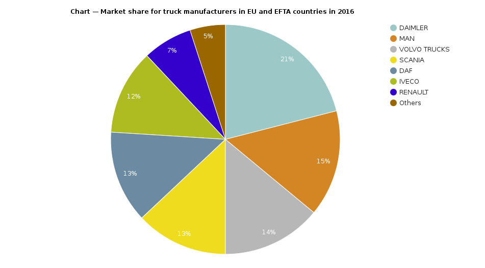
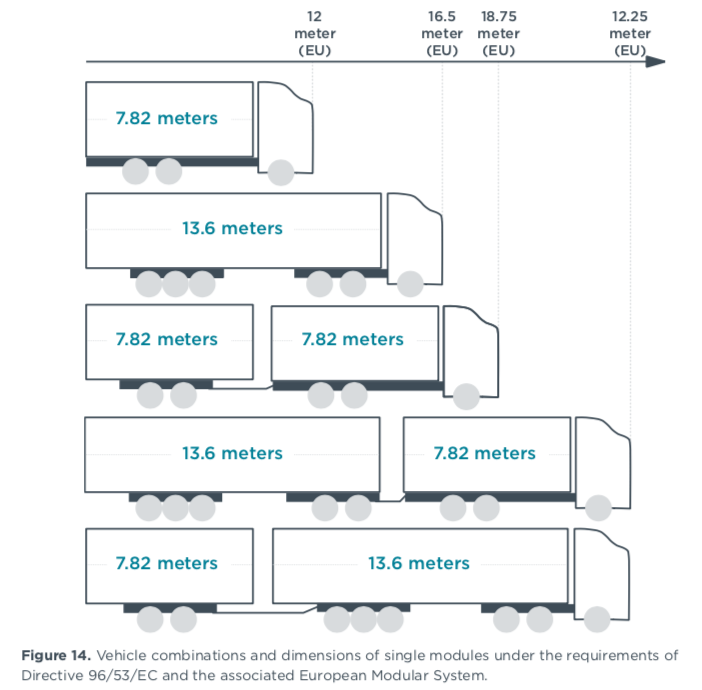

# Research types of Trucks
This file contains information about 3 different truck models, these models will  be parameters in the web-app and the goal is to let the user of this applet adjust between different trucks.
This should provide the user with different results based on the different models of the trucks used as parameter.
This is because we expect different models to have differing maximal loads (depending of good sizes and weight).

## General information
### Trucks (light & heavy duty)
The truck manufacture with the greatest market share is DAIMLER.
About 21% of trucks on the roads in Europe are manufactured by DAIMLER.
([Source](https://www.eea.europa.eu/data-and-maps/daviz/hdv-market-share-for-vehicle#tab-chart_1))

With regards to light duty trucks in the EU there is even more statistics available.
According to the paper "European vehicle market statistics" the most used model of light duty truck is the Ford Transit.
The Ford Transit alone accounts for about 12.5% of the light-commercial vehicle models on the roads in Europe.

### Trailers
The European union has set regulations on trailers, these regulations restrict the weight & lengths.
The goal of the regulations is ensure equal access to the road network and fair competition between in the transport industry.
In the EU the maximal Gross vehicle weight (GVW) of tractors is limited to 40 tonnes in comparison the maximal GVW in the US this is 36.3 tonnes.
(Source: Market analysis of heavy-duty commercial trailers in Europe)

> The gross vehicle weight rating (GVWR), or gross vehicle mass (GVM) is the maximum operating weight/mass of a vehicle 
> as specified by the manufacturer including the vehicle's chassis, body, engine, engine fluids, fuel, accessories, 
> driver, passengers and cargo but excluding that of any trailers. The term is used for motor vehicles and trains.
> 
> -- ([Wikipedia, the free encyclopedia](https://en.wikipedia.org/wiki/Gross_vehicle_weight_rating)) 

The European defines 2 different max lengths of trailers. 
The limit is 13.6m for box semi-trailers, and for road trains the limit is 18.75 (A road train is a truck with a series of trailers attached to it).
Other European countries such as Finland, Iceland, Norway, or Sweden allow for longer trailers and road trains, this is achieved by combining different models together to make longer ones.
(Source: Market analysis of heavy-duty commercial trailers in Europe)

The largest producer of semitrailers in Europe is Schmitz Cargobull in 2011 their market share stabilized around 26% of the total market share.

> Gross Combination Weight (GCW) — the value specified by the manufacturer as the maximum loaded weight of a truck/tractor 
> plus the trailer or semitrailer designed for use with the truck tractor. In the absence of a value specified by the 
> manufacturer, GCW will be determined by adding the gross vehicle weight (GVW) of the power unit and the total weight 
> of the towed unit and any load thereon.
>
> -- ([IRMI](https://www.irmi.com/term/insurance-definitions/gross-combination-weight))

## Truck A - Ford Transit
### Speed

### Capacity

### Fuel & Engine

## Truck B - 
### Speed

### Capacity

### Fuel & Engine

## Truck C - 
### Speed

### Capacity

### Fuel & Engine

## Sources 

- https://www.eea.europa.eu/data-and-maps/daviz/hdv-market-share-for-vehicle#tab-chart_1
- White paper "European vehicle market statistics"
- White paper "Market analysis of heavy-duty commercial trailers in Europe"
- https://www.irmi.com/term/insurance-definitions/gross-combination-weight
- https://en.wikipedia.org/wiki/Gross_vehicle_weight_rating#cite_note-49CFR571.3-1
