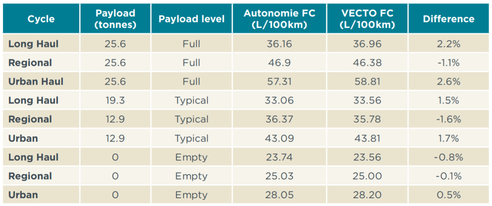
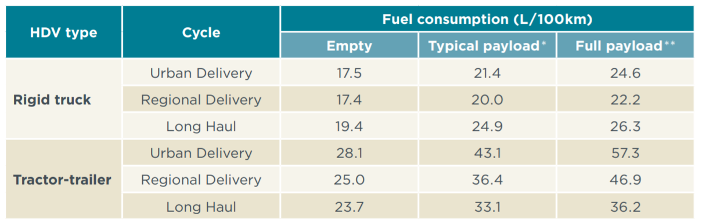

# Background information

## Statistics on trucks in Europe

In 2019, there were 6.6 million trucks on the EU’s roads. With more than 1.1 million trucks, Poland has the
largest truck fleet, followed closely by Germany (946,541) and Italy (904,308).
98.3% of all trucks in the EU run on diesel, while petrol fuels only 1%. (Source: European Automobile Manufacturers Association)

Another source states that "There were over 4.3 million good vehicles registered in the EU in 2018."
Note that these are just the <i>registered</i> vehicles.

In 2018, Europe had a total of 1 924 955 million tonne-kilometers. 1 tonne-kilometer is the transport of 1 tonne over 1 kilometer.
(<a href="https://ec.europa.eu/eurostat/statistics-explained/index.php?title=File:RFT,_2014-2018_(million_tonne-kilometres).png">Source</a>)

### Vehicle load

EU average vehicle loads for international transport were 16.0 tonnes in 2018.
(<a href="https://ec.europa.eu/eurostat/statistics-explained/index.php/Road_freight_transport_by_journey_characteristics#Average_vehicle_loads">Source</a>)

At the same time, though, in 2018, 85.4 % of EU road freight transport was done by vehicles with a maximum permissible laden weight over 30 tonnes.
Most Member States recorded their highest shares for laden weight of over 40 tonnes, with proportions over 90 % in the 
Netherlands (96.3 %), Estonia (96.0 %) and Croatia (90.8 %). 
The largest shares of 30.1 to 40 tonnes were observed in Spain (91.6 %), Poland (91.5 %) and Portugal (89.1 %).
(<a href="https://ec.europa.eu/eurostat/statistics-explained/index.php?title=Road_freight_transport_by_vehicle_characteristics">Source<a>)

### Empty runnings
At EU level, 12.3 % of road freight journeys in international transport were performed by empty vehicles.
At the national transport level, most Member States fell in the range between 15 % and 30 % empty journeys. The Netherlands has 21.5 % empty journeys.
(<a href="https://ec.europa.eu/eurostat/statistics-explained/index.php/Road_freight_transport_by_journey_characteristics#Empty_runnings">Source</a>)

## Fuel consumption of a baseline tractor-trailer

## Fuel consumption of a rigid truck

## Sources

- White paper "Fuel efficiency technology in European heavy-duty vehicles: Baseline and potential for the 2020–2030 timeframe"
- https://ec.europa.eu/eurostat/statistics-explained/index.php/Road_freight_transport_by_journey_characteristics
- https://ec.europa.eu/eurostat/statistics-explained/index.php?title=Road_freight_transport_by_vehicle_characteristics
- http://www.freightmetrics.com.au/Calculators%7CRoad/tabid/101/Default.aspx
- https://ec.europa.eu/clima/policies/transport/vehicles/vecto_en#tab-0-1

