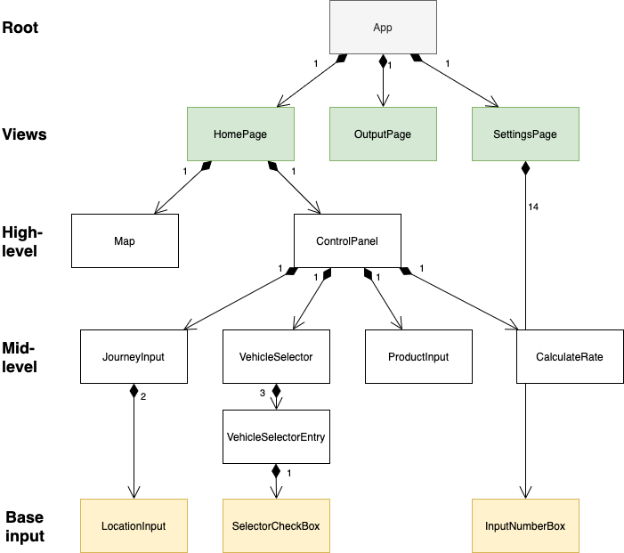

<!--
The goal of this document is to allow you to present the architecture of what you have already but also what you are aiming at.
(e.g. if you plan to use Angular on the front-end, but didn’t start using it yet, do mention this).
One of the goals of this document is to make sure that the SE Staff has a good overview of what everybody is doing so we can offer you the best advice :)
-->


# Architecture document
<!--
A nice cover:...will make the us happy.
Add the project title, the client, the team names, TA name and the document version.
-->

**Sharing Logistics Simulation**

_Client: Astone Shi_

Version 1.5

Team:
- Antonin Thioux
- Bjar Karim
- Gheorghe Pojoga
- Lonneke Pulles
- Lorenzo La Rocca

Under supervision of Alex Tutea


## Introduction
<!--
A brief introduction to the product, highlighting the specifics that influence the architecture and design choices.
-->

The product will be a web application that is simulating the effect that sharing space for goods would have.
The application's main goal is to determine if it would be a worthwhile idea to set up a platform on which companies or truck owners could offer empty space to transport other people's goods.

The user can set multiple parameters for the simulation:
1. The locations A and B as well as their radius,
2. The number of trucks for each of three predefined types,
3. The types of goods, which each have volume, weight, quantity as well as pick-up and delivery locations.

The user has to input the location A and B and specify their radius.
Afterwards, the pick-up location of every product must be within the radius of any of these points.
The delivery location must be imputed analogously.
This approach is necessary for the shared logistics model, where a truck picks up as many products as possible around a given point and then delivers them within the radius of the other one.

The three metrics that will show the result of the simulation are:
- Transport time
- CO2 emissions
- Number of trucks used


## Architectural overview
<!--
Architectural overview: What components are there and what are their functions?
How are components connected/communicating?
If a more general principle or a paradigm is applied that is worth mentioning, mention it.
-->

The project does not need a persistent database, because all simulated data will be calculated on the spot every time.
This web application is designed without a database or back end and so the front end makes up the entire application.
We thought that the calculations for the simulation are simple enough to be able to do them in the front-end application.
Adding a back-end and a necessary API to connect the two applications would make the project unnecessarily complicated.
If the application should be extended to store the results of the simulation in the future.
A database and back-end application can be added to the project without having to change too much in the already existing front-end application.

The application is mainly created with Vue.js.
This is a lightweight and open source front-end Javascript framework that mainly focuses on simplifying the creation of a dynamic Single Page Application.
A Vue project is split into two folders: a folder for static content called 'public' and a folder for reactive content called 'src'.
This latter contains javascript files and so-called Vue (view) components, which can be composed of other Vue components.
Each component consists of three parts: an html template, a Vue part (where local data is stored and methods are created) and a css style part.
These types of components are called single-file components and this is what largely characterises .vue files.

In a more abstract way, the Vue app can split into three parts: the state, actions and the view.


The state consists of a store with the data.
The actions are defined as functions in the .vue files and indirectly called by the user.
The view consists of Vue components, which can be visualised as a tree.
For our project, the view is composed of the following Vue components:


The root component of the view is called App.vue.
This App.vue file is linked to by a file called main.js, which first renders the app and then mounts it.

The top-level components are the two views, or web pages, called Home.vue and OutputPage.vue.

The Home view consists of two high-level components, ControlPanel.vue and Map.vue.
In the ControlPanel the user can enter their input and choose values for the given parameters that will determine the simulation.

These high-level components use the middle-level components JourneyInput, ProductInput, VehicleSelector and CalculateRate.

These middle-level components, on their turn, may use the base components: LocationInput and SelectorCheckBox.

The exact file structure and explanations of what the responsibility of each file is, can be found below.

````
├── public
│   └── index.html
└── src
    ├── main.js                         # renders and mounts the app
    ├── App.vue                         # the root of the app
    ├── components
    │   ├── CalculateRate.vue           # combines all input after the calculate rate button has been pressed and
    │   │                                 stores this information
    │   ├── ControlPanel.vue            # the panel on the left of the screen that handles the input
    │   ├── JourneyInput.vue            # input component for the starting and final destinations
    │   ├── LocationInput.vue           # base input component for locations
    │   ├── Map.vue                     # displays the map and its components
    │   ├── ProductInput.vue            # input component for the goods
    │   ├── SelectorCheckBox.vue        # base input component for a checkbox
    │   ├── VehicleSelector.vue         # input component for all vehicle types
    │   └── VehicleSelectorEntry.vue    # input component for 1 vehicle type
    ├── router                          
    │   └── index.js                    # contains the references to the two pages of the application
    ├── store
    │   └── index.js                    # stores information that multiple parts of │the application need access to
    └── views                           # the pages of the application
        ├── Home.vue                    # contains the input panel and the map
        └── OutputPage.vue              # displays the simulated results
````

Note that each element of the view can access the application's store.

Since Vue is meant to create Single Page Applications, we added a router to the project.
What this router essentially does is mounting one of the two views (Home or OutputPage) to App.vue.


## Technology Stack
<!--
Technology Stack: What programming languages are being used?
What technologies are being used (Frameworks, libraries, platform, peripherals)?
If different components have different technologies, present them individually.
-->

The following is a list of used technologies and frameworks:
- HTML
- CSS
- JavaScript
- Vue.js
  - A Progressive JavaScript Framework
  - Libraries used:
    - Vuex: a state management pattern and library for Vue.js applications.
    Enables us to create a store which can be accessed anywhere in the application.
    - Vue Router: enables us to map Vue components to routes and Vue Router renders them when needed.
    Makes it seem as if the application has multiple pages.
- npm
  - Node Package Manager.
  Required to install and run Vue.js
- Node.js
  - Required for npm.
  A back-end Javascript framework.

For the map, we use:
- Leaflet, an open source Javascript mapping library.
  - Open source alternative to Google Maps API.
  Javascript mapping library.
  - Plugins we used:
    - vue2-leaflet - it provides wrapping constructs of the basic Leaflet objects, which are designed for the Vue framework.
    - leaflet-routing-machine - this library is used for all the functionality that is related to routing.
     Used for; finding the route, displaying the route, determining the distance and time necessary to complete the route etc.
- leaflet GeoSearch
  - To enable searching based on addresses and names instead of coordinates.
  - Though it is called leaflet GeoSearch, it has no dependencies on Leaflet.

### Why we chose these technologies

#### Vue.js
Since nobody in our team had any experience with creating web applications, we couldn't make the decisions based on our own experience.
We wanted to make a choice between the three most popular front-end Javascript frameworks, Angular, React and Vue.js.
These frameworks allow Javascript code to be structured into components.

Since is Vue.js is said to have the lowest learning curve out of the three frameworks, we decided to go with Vue.js.
Our TA also recommended this and on Stackshare.io it can be seen that Vue.js has the highest approval ratings.

Some other advantages of Vue.js are that:
- It is lightweight and therefore quite fast, especially in comparison with Angular.
- It is an MVC framework.
- It is the newest technology and is meant as an improvement over Angular and React.

Some disadvantages are that:
- It has a smaller community and less documentation.
  However, we considered the documentation to be good enough.
- It has fewer libraries than Angular and React.
  However, the framework offers more than enough libraries to suit our project's needs.

#### Leaflet
Initially, we wanted to use the Google Maps API to show the map in the application, to show markers on the map, to find the route between the start and end locations and to calculate the time and distance needed for that route.
Later on in the project we found out that we had to fill in payment details for the routing functionality.
Though it would initially be free, we would have to pay if the application made more than a certain amount of requests per month.
Since we didn't want to have the risk of one of us or our client having to pay a lot of money unintentionally, we decided to use an open source map API instead.

Leaflet is the most-used Javascript library for interactive maps.
After some searching, we found that it had all features we needed if we used some extra plugins.
It allows us to connect to OpenStreetMap, a free wiki world map.


## Team organization
<!--
Team Organization: What teams are there and what are their responsibilities?
Are the team responsibilities focused on different components?
-->

There is one team in our project.
Each member of this team has their own Vue component to work on however, we created and divided the architecture together.
When two components needed to be connected, the two team members worked on it together.
Moreover, if anyone needed help, we of course helped our teammate with their part(s).

The division was as follows:
Antonin created the VehicleSelector,
Bjar created the ProductInput,
Gheorghe created the Map and the store,
Lorenzo created the ControlPanelOutput and,
Lonneke created the JourneyInput.


## Change log
<!--
Change Log: Descriptive list of changes made to the document tagged with date and author.
-->

| Who     | When       | What
| ------- | ---------- | -----
| Lonneke | 11-03-2020 | First draft of the architecture document.
| Lonneke | 24-03-2020 | Updated technologies and added introduction, file structure and image of architecture.
| Lonneke | 04-04-2020 | Added why we chose technologies and blackbox description in introduction.
| Gheorghe| 06-04-2020 | Added the plugins necessary for the map
| Gheorghe| 20-04-2020 | Updated the introduction and the application architecture
| Antonin | 26-04-2020 | ...
