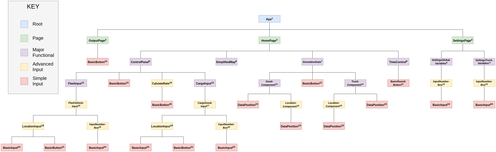

<!--
    The goal of this document is to allow you to present the architecture of what you have already but also what you are aiming at.
    (e.g. if you plan to use Angular on the front-end, but didn’t start using it yet, do mention this).
    One of the goals of this document is to make sure that the SE Staff has a good overview of what everybody is doing so we can offer you the best advice :)
-->


# Architecture document
<!--
    A nice cover:...will make the us happy.
    Add the project title, the client, the team names, TA name and the document version.
-->

**Sharing Logistics Simulation**

_Client: Astone Shi_

Version 1.5

Team:
- Antonin Thioux
- Bjar Karim
- Gheorghe Pojoga
- Lonneke Pulles
- Lorenzo La Rocca

Under supervision of Alex Tutea


## Introduction
<!--
    A brief introduction to the product, highlighting the specifics that influence the architecture and design choices.
-->

The product will be a web application that is offers the possibility of comparing the traditional and the shared logistics.
The application's main goal is to determine if it would be a worthwhile idea to set up a platform on which companies or truck owners could offer empty space to transport other people's goods.

The user can set multiple parameters for the simulation:
1. The initial location of the trucks,
2. The number of trucks for each of three predefined types,
3. The parameters for every product i.e.,  volume, weight, quantity as well as pick-up and delivery locations.

The three metrics that will show the result of the simulation are:
- Total transportation time
- Total traveled distance by all trucks
- Number of trucks used
- Total CO2 emissions
- Total fuel consumed
- Average delivery time
- Average transit time

## Architectural overview
<!--
    Architectural overview: What components are there and what are their functions?
    How are components connected/communicating?
    If a more general principle or a paradigm is applied that is worth mentioning, mention it.
-->

The project does not need a persistent database, because all simulated data will be calculated on the spot every time.
This web application is designed without a database or back end and so the front end makes up the entire application.
We thought that the calculations for the simulation are simple enough to be able to do them in the front-end application.
Adding a back-end and a necessary API to connect the two applications would make the project unnecessarily complicated.
If the application should be extended to store the results of the simulation in the future.
A database and back-end application can be added to the project without having to change too much in the already existing front-end application.

The application is mainly created with Vue.js.
This is a lightweight and open source front-end Javascript framework that mainly focuses on simplifying the creation of a dynamic Single Page Application.
A Vue project is split into two folders: a folder for static content called 'public' and a folder for reactive content called 'src'.
This latter contains javascript files and so-called Vue (view) components, which can be composed of other Vue components.
Each component consists of three parts: an html template, a Vue part (where local data is stored and methods are created) and a css style part.
These types of components are called single-file components and this is what largely characterises .vue files.

In a more abstract way, the Vue app be can split into three parts: the state, actions and the view.


The state consists of a store with the data.
The actions are defined as functions in the .vue files and indirectly called by the user.
The view consists of Vue components, which can be visualised as a component hierarchy diagram.
Where multiple smaller components make up a larger component.
For our project, the following Vue components compose the view:

  1. The App component is the root component of the webapp, it encompasses everything.
  It is connected to the router which tells it which page to show.
  2. OutputPage is the component responsible for displaying the output once the simulation has run.
  It contains a BasicButton with allows the user to return to the HomePage.
  3. HomePage is the component where the user sets the parameters of the simulation as well as where the simulation is displayed.
  It contains a SimplifiedMap to show the simulation, a ControlPanel to change the parameters, a TimeControl to change the time during the running of the simulation, and a data panel to display data during the simulation.
  4. SettingsPage allows the user to change specific settings in the simulation.
  It contains SettingsGlobalVariable to set settings for the global variables, and SettingsTruckVariables set of settings of variables for each truck.
  5. ControlPanel allows the user change parameters in the simulation.
  It contains a BasicButton to go to the SettingsPage, a FleetInput to change the trucks, a CargoInput to change the goods, and a CalculateRate component to start the simulation.
  6. SimplifiedMap is the component to show a map to the user.
  It doesn't contain any other components.
  7. SimulationData is the component displaying real-time data as the simulation is running to the user.
  It contains a BasicButton to get user input on when to end the simulation, as well as GoodComponent and TruckComponent to display data about goods and trucks.
  8. TimeControl is the component allowing the user to change the passage of time while the simulation is running.
  It contains multiple BasicRoundButtons to get user input on controls.
  9. SettingsGlobalVariables is the component allowing the user to change globals variables.
  It contains multiple InputNumberBox to model the variables in the webapp.
  10. SettingsTruckVariables is a component allowing the user to change variables for a certain truck type.
  It contains multiple InputNumberBox to model the variables in the webapp.
  11. FleetInput is the component allowing the user to change the parameters of all trucks in the simulation.
  It contains multiple FleetVehicleInput for each truck in the simulation.
  12. CargoInput is the component allowing the user to change the parameters of all goods in the simulation.
  It contains multiple CargoGoodInput for each good in the simulation.
  13. GoodComponent is the component responsible for displaying real-time data about goods as the simulation is running.
  It contains multiple LocationComponent to display data about locations, and a single DataPosition to know when to display additional data.
  14. TruckComponent is the component responsible for displaying real-time data about trucks as the simulation is running.
  It contains multiple LocationComponent to display data about locations, and a single DataPosition to know when to display additional data.
  15. CalculateRate is the component allowing the user to start the simulation with Sharing enabled or disabled.
  It contains two BasicButtons to get user input on controls.
  16. FleetVehicleInput is a component allowing the user to change parameters of a certain truck entry.
  It contains LocationInput for the starting location of the truck as well as BasicInput for the number of truck in this entry.
  17. CargoGoodInput is a component allowing the user to change parameters of a certain good entry.
  It contains LocationInput for pickup and delivery location of the good as well as BasicInput for the InputNumberBox parameters of the good entry.
  18. LocationComponent is a component responsible for displaying real-time data about a particular location.
  It contains a single DataPosition to know when to display the additional data.
  19. LocationInput allows the user to input a location.
  It contains BasicInput to allow the user to type the location as well as BasicButton to allow the user to select a location through the map.
  20. InputNumberBox is the component handling number input for the user.
  It contains a BasicInput to get user input.
  21. BasicButton gets basic input from the user through a square shaped button.
  It is a basic component and thus contains no other components.
  22. BasicRoundButton get basic input from the user through a circle shaped button.
  It is a basic component and thus contains no other component.
  23. DataPosition get basic input from the user through a button, it determines whether data should be collapsed or not.
  It is a basic component and thus contains no other component.
  24. BasicInput gets basic input from the user through a text field.
  It is a basic component and thus contains no other components.

During the first block of development of the web-app, the ControlPanel over coupled compared to the of rest the component hierarchy.
However after we inevitably added more components we made an effort to keep components balanced. 
This is reflected by the fact that each component only has 0-4 child components, with most components having 2 or 3. 

The exact file structure can be found below.
A short description of responsibilities is also provided for each of the files.
````
├── public
│   ├── assets
│   │   ├── credits                     # link to site where diagrams where taken
│   │   ├── good_drop.svg               # diagram of a delivery location of a good
│   │   ├── good_pickup.svg             # diagram of a pickup location of a good
│   │   ├── goods.svg                   # diagram of a good used int he webapp
│   │   ├── heavy_duty_van.svg          # diagram of heavy duty van used in the webapp
│   │   ├── light_duty_van.svg          # diagram of light duty van used in the webapp
│   │   └── train_truck.svg             # diagram of train truck used in the webapp
│   ├── favicon.png                     # the icon used of the webapp
│   └── index.html
└── src
    ├── main.js                         # renders and mounts the app
    ├── App.vue                         # the root of the app
    ├── classes                         # folder containing all classes use in the simulation
    │   ├── goods
    │   │   └── Good.js                 # The class representing a good in the simulation
    │   ├── Router.js                   # The class used for routing trucks.
    │   ├── simulation
    │   │   ├── FreightPlatform.js      # The class that distributes the goods among the trucks
    │   │   ├── Simulation.js           # The class containing the simulation.
    │   │   ├── SimulationType.js       # The class defining the different simulation types.
    │   │   └── TruckTracker.js         # This class keeps track of which trucks are done with there delivering all goods.
    │   ├── Time.js                     # The class responsible for the passage of time during the simulation.
    │   ├── trucks
    │   │   ├── CostHandler.js          # This class handles finding the cost of adding a new order to a truck.
    │   │   ├── PlanManager.js          # This class handles the orders of a truck in a simulation.
    │   │   ├── SharedTruck.js          # The class containing the logic for how a truck operates in a sharing logistics simulation.
    │   │   ├── TraditionalTruck.js     # The class containing the logic for how a truck operates in a traditional simulation.
    │   │   ├── Truck.js                # The class representing a truck in the simulation.
    │   │   ├── TruckPropertyHandler.js # This class stores the properties of a truck in the simulation.
    │   │   └── TruckState.js           # This class represents the different states of a truck.
    │   ├── util
    │   │   ├── Observable.js           # A class that other objects can observe.
    │   │   └── UpdateMessage.js        # This class represents the different updates messages that can be sent.
    │   └── view
    │       ├── GoodView.js             # The class responsible for drawing the good on the map.
    │       └── TruckView.js            # The class responsible for drawing the truck on the map.
    ├── components
    │   ├── BasicButton.vue             # base input for a square button with text in it
    │   ├── BasicInput.vue              # base input for a text box
    │   ├── BasicRoundButton.vue        # base input for a round button
    │   ├── CalculateRate.vue           # input button to run the simulation
    │   ├── CargoGoodInput.vue          # input component for a single good
    │   ├── CargoInput.vue              # input component for all the goods
    │   ├── ControlPanel.vue            # the panel on the left of the screen that handles the input
    │   ├── FleetInput.vue              # input component for all vehicle types
    │   ├── FleetVehicleInput.vue       # input component for 1 vehicle type
    │   ├── InputNumberBox.vue          # base input component for numbers
    │   ├── LocationInput.vue           # base input component for locations
    │   ├── SettingsGlobalVariables.vue # input for changing a global variable for the simulation
    │   ├── SettingsTruckVariables.vue  # input for changing a variable of a certain truck type
    │   ├── SimplifiedMap.vue           # displays the map and its components
    │   ├── simulationData
    │   │   ├── DataPosition.vue        # gets input from the user whether or not a container should be collapsed or not
    │   │   ├── GoodComponent.vue       # displays data related to goods while the simulation is running
    │   │   ├── LocationComponent.vue   # displays data related to locations while the simulation is running
    │   │   ├── SimulationData.vue      # displays data while the simulation is running
    │   │   └── TruckComponent.vue      # displays data related to trucks while the simulation is running
    │   └── TimeControl.vue             # displays the time of the simulation
    ├── router
    │   └── index.js                    # contains the references to the pages of the application
    ├── store
    │   ├── actions.js                  # alters the state of the application by performing mutations
    │   ├── getters.js                  # contains all the getters to get the information of the application
    │   ├── index.js                    # stores information that multiple parts of the application need access to
    │   └── mutations.js                # changes the information of the applications
    ├── util
    │   ├── avg.js                      # a utility function to get the average value of a list of values
    │   ├── EuclidDist.js               # a utility function to distance between two coordinates on a flat plane.
    │   └── haversine.js                # a utility function to calculated the real distance between two coordinates.
    └── views
        ├── HomePage.vue                # contains the input panel and the map
        ├── OutputPage.vue              # displays the simulated results
        └── SettingsPage.vue            # contains constants that can be changed
````

Note that each element of the view can access the application's store.

Since Vue is meant to create Single Page Applications, we added a router to the project.
What this router essentially does is mounting one of the three views (Home, OutputPage or SettingsPage) to App.vue.


## Technology Stack
<!--
    Technology Stack: What programming languages are being used?
    What technologies are being used (Frameworks, libraries, platform, peripherals)?
    If different components have different technologies, present them individually.
-->

The following is a list of used technologies and frameworks:
- HTML
- CSS
- JavaScript
- Vue.js
  - A Progressive JavaScript Framework
  - Libraries used:
    - Vuex: a state management pattern and library for Vue.js applications.
    Enables us to create a store which can be accessed anywhere in the application.
    - Vue Router: enables us to map Vue components to routes and Vue Router renders them when needed.
    Makes it seem as if the application has multiple pages.
- npm
  - Node Package Manager.
  Required to install and run Vue.js
- Node.js
  - Required for npm.
  A back-end Javascript framework.

For the map, we use:
- Leaflet, an open source Javascript mapping library.
  - Open source alternative to Google Maps API.
  Javascript mapping library.
  - Plugins we used:
    - vue2-leaflet - it provides wrapping constructs of the basic Leaflet objects, which are designed for the Vue framework.
- leaflet GeoSearch
  - To enable searching based on addresses and names instead of coordinates.
  - Though it is called leaflet GeoSearch, it has no dependencies on Leaflet.

### Why we chose these technologies

#### Vue.js
Since nobody in our team had any experience with creating web applications, we couldn't make the decisions based on our own experience.
We wanted to make a choice between the three most popular front-end Javascript frameworks, Angular, React and Vue.js.
These frameworks allow Javascript code to be structured into components.

Since Vue.js is said to have the lowest learning curve out of the three frameworks, we decided to go with Vue.js.
Our TA also recommended this and on Stackshare.io it can be seen that Vue.js has the highest approval ratings.

Some other advantages of Vue.js are that:
- It is lightweight and therefore quite fast, especially in comparison with Angular.
- It is an MVC framework.
- It is the newest technology and is meant as an improvement over Angular and React.

Some disadvantages are that:
- It has a smaller community and less documentation.
  However, we considered the documentation to be good enough.
- It has fewer libraries than Angular and React.
  However, the framework offers more than enough libraries to suit our project's needs.

#### Leaflet
Initially, we wanted to use the Google Maps API to show the map in the application, to show markers on the map, to find the route between the start and end locations and to calculate the time and distance needed for that route.
Later on in the project we found out that we had to fill in payment details for the routing functionality.
Though it would initially be free, we would have to pay if the application made more than a certain amount of requests per month.
Since we didn't want to have the risk of one of us or our client having to pay a lot of money unintentionally, we decided to use an open source map API instead.

Leaflet is the most-used Javascript library for interactive maps.
After some searching, we found that it had all features we needed if we used some extra plugins.
It allows us to connect to OpenStreetMap, a free wiki world map.


## Team organization
<!--
    Team Organization: What teams are there and what are their responsibilities?
    Are the team responsibilities focused on different components?
-->

There is one team in our project.
Each member of this team has their own Vue component to work on however, we created and divided the architecture together.
When two components needed to be connected, the two team members worked on it together.
Moreover, if anyone needed help, we of course helped our teammate with their part(s).

The division during the first block was as follows:
Antonin created the VehicleSelector,
Bjar created the ProductInput,
Gheorghe created the Map and the store,
Lorenzo created the ControlPanelOutput and,
Lonneke created the JourneyInput.

The division during the second block was more nuanced. Check Trello for more details.

## Change log
<!--
    Change Log: Descriptive list of changes made to the document tagged with date and author.
-->

| Who      | When       | What
| -------- | ---------- | -----
| Lonneke  | 11-03-2020 | First draft of the architecture document
| Lonneke  | 24-03-2020 | Updated technologies and added introduction, file structure and image of architecture
| Lonneke  | 04-04-2020 | Added why we chose technologies and blackbox description in introduction
| Gheorghe | 06-04-2020 | Added the plugins necessary for the map
| Gheorghe | 20-04-2020 | Updated the introduction and the application architecture
| Antonin  | 26-04-2020 | Updated the file structure and application architecture
| Gheorghe | 04-05-2020 | Updated the introduction
| Antonin  | 26-05-2020 | Updated the file structure and hierarchy diagram
| Antonin  | 12-06-2020 | Updated the file structure and hierarchy diagram
| Gheorghe   | 12-06-2020  | Small changes in the introduction and Technology Stack  |
