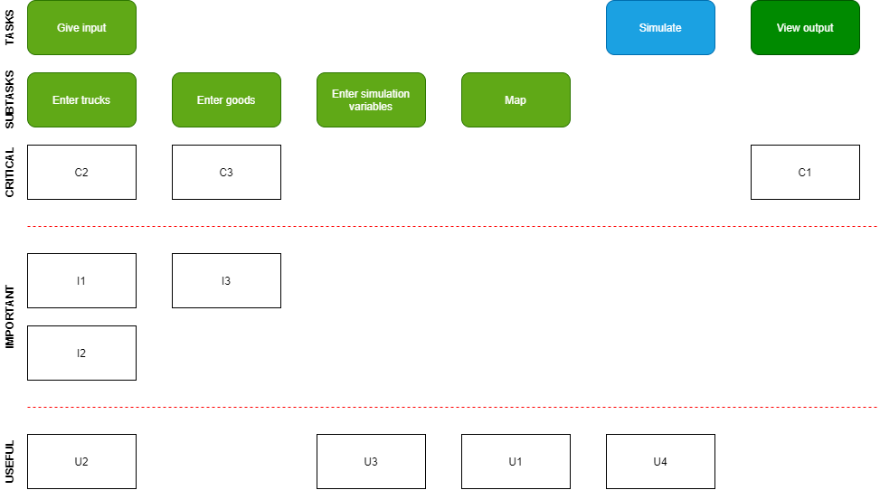

# Requirements Document
### **Sharing Logistics Simulation** -  2020
   Version : 2.0   
   Client : Astone Shi ( astone.shi@gmail.com or c.shi@rug.nl )  
   TA : Alex Tutea
* Antonin Thioux
* Bjar Karim
* Gheorghe Pojoga
* Lonneke Pulles
* Lorenzo La Rocca

## Introduction
As the world is more globally connected now than ever, goods are transported large distances before reaching the locations where they will be used and sold.
One of the many ways these goods are transported is by road vehicles.
These vehicles often make journeys carrying less than complete capacity.
This is expected to be an inefficient use of resources and an increase in carbon emissions.
However, it is unclear whether or not **sharing logistics** would have a worthwhile impact on the inefficient
use of resources and carbon emission.

By sharing logistics we mean that trucks can carry goods by different owners at the same time, instead of carrying the goods
of only one owner, which we call the **traditional** method. In a sense sharing logistics is like an Uber for goods,
where each truck can perform tasks for multiple clients simultaneously.

The goal of this project is to produce a program with simulation functionality.
The simulation should provide insight into the use of resources and carbon emissions in the context of transport of goods by road vehicles.
Two processes need to be simulated so that they can be compared. The first process should be the current (traditional)
method that goods are transported, the second process should be the **sharing logistics** method.

### System overview
The system of this project is pretty simple since the system doesn't require any information to be saved.
Hence the system doesn't require a database and all calculation can be performed in the front end.
Additionally, none of the calculation needs to be done in secrecy from the user such that they can't be copied.
For these two reasons we have decided to structure the system entirely in the website.

### Actors and stakeholders

Our system has only one actor: the person that wants to see the simulation and results given certain input.

In addition to the actor there are also stakeholders that may have in interest in this system. These are:

- Existing digital freight platforms that apply the sharing logistics method, such as Saloodo.com
- Transportation and logistics companies such as Uber and DHL, since they could use the system to calculate how much money they could save by sharing logistics.
- Otherwise unrelated companies that have a delivery branch, such as pizza chains, since they could calculate how much money they could save by sharing logistics for small packages.
- Governments and environmental NGOs, since they could calculate how much CO2 and fuel could be saved when trucks start sharing logistics.

## User Stories
The functional requirements for this project are described with user stories. We have converted the client's description
of the project into these user stories.

This project only has a single user who is using the applet: our client.
This user wants to know which how the two methods of transportation (traditional / **sharing logistics**) differ on
given variables, such as total distance travelled and overall carbon emissions.
The outcomes depend on different parameters that the user can vary: the number and types of trucks, start
locations, number and types of goods, etc.

We have divided the requirements in five categories: the functional requirements (divided into critical, important, useful and unused user stories)
and non-functional requirements. Must haves, should haves, could haves and won't haves are different ways of classifying the functional requirements, from the naming system called MoSCoW.

Critical, important and useful user stories have different degrees of priority: high, middle and low, respectively.
The critical user stories are ones that have to be in the final product: they are must haves. They have to
be in the minimum viable product (MVP). Important user stories should be in the final product, but have less priority
than critical user stories: they are should haves. Useful user stories would be nice to add to the system if time allows
it: they are could haves.

There are also user stories that we won't implement in this project: won't haves. They could
be implemented in the future, but they definitely won't be implemented during this course.

The non-functional requirements are constraints on the system or development process.

<!-- All requirements and user stories should be able to be objectively verified. -->

### Critical User Stories - must haves
As a user of this applet I want to be able to...  
1. [x] (C1) compare the two methods of transport based on certain parameters so that I can inform my opinion of which method is better.
   - [x] (C1.1) compare the two methods based on the CO2 emission.
   - [x] (C1.2) compare the two methods based on the total distance travelled.
   - [x] (C1.3) compare the two methods based on the number of trucks used so that I get an indication of additional costs, such as paying truck drivers.
2. [x] (C2) input a truck, which is a sort of blueprint.
    - [x] (C2.1) specify one given start location for all trucks so that the path and distance travelled by the trucks can be simulated realistically on a real map.
    - [x] (C2.2) specify the quantity of the truck such that multiple trucks can pickup goods.
3. [x] (C3) input multiple goods.
   - [x] (C3.1) specify the pick-up and delivery location of every good so that I can see what effect this has on the transportation of these goods under both systems.
   - [x] (C3.2) specify the quantity of a good so that I don't have to fill in the same good multiple times

### Important User Stories - should haves
As a user of this applet I want to be able to...
2. [x] (I1) select the type of truck in the blueprint for a truck.
   - [x] (I1.1) have three predefined types of vehicles with different sizes so that I can easily vary between different types of trucks.
3. [x] (I2) vary some parameters of the goods so that I can make the simulation more realistic.
   - [x] (I2.1) change the weight of the goods that need to be transported so that I can see what effects this has on both systems of transportation.
   - [x] (I2.2) change the size of the goods that need to be transported so that I can see what effect this has on the transportation of these goods under both systems.

### Useful User Stories - could haves
As a user of this applet I want to be able to...  
1. [x] (U1) change the starting locations of trucks and pickup and delivery locations of goods using a digital map so that I can change the locations easily by clicking.
2. [x] (U2) add multiple blueprints for trucks so that I can have more control over the trucks that are inputted.
   - [x] (U2.1) input a different starting location for each (blueprint of a) truck so that the simulation is more realistic.
3. [x] (U3) (but not obliged to) vary parameters that are used in the background of the simulation
such that I can adapt these values to more realistic ones and see the influence that varying these values has.
These parameters are:
    - emission burnt factor
    - max number of splits of the goods
    - for each type of truck:
        - the max volume
        - max payload
        - empty fuel consumption
        - full fuel consumption.
4. [x] (U4) actually simulate (i.e. animate) the movement of trucks and goods over time so that I can more realistically see how the trucks and goods are transported over time and so that I
can compare the two methods (traditional and sharing logistics) visually.
   - [x] (U4.1) have an animation of a moving truck so that I can have a visual representation of the problem.
   - [x] (U4.2) view the pickup and delivery locations of the goods on the map so that I can have a visual representation of the problem.
   - [x] (U4.3) see when the simulation has finished so that I know when to continue with another action, such as viewing the results or starting another type of simulation.
   - [x] (U4.4) view per truck how its values (current location, number of goods delivered, current load in kg and in volume) change during the simulation.
   - [x] (U4.5) view per good how its values (picked up or not, delivered or not, current location) change during the simulation.
   - [x] (U4.6) choose if I simulate the traditional method or the sharing logistics method.
   - [x] (U4.7) control the time of the simulation.
       - [x] (U4.7.1) pause/continue the time so that I can take as long as I want if I need to inspect the current state of the animation.
       - [x] (U4.7.2) accelerate the time so that the simulation can finish in a reasonable time.
       - [x] (U4.7.3) decelerate the time so that I can slow down the simulation if it is going too fast.

### Unused User Stories - won't haves
As a user of this applet I won't be able to ...  
1. [ ] (W1) allow the trucks that are part of the **sharing logistics** to first deliver a good to an intermediate point and let it be picked up by a second truck that delivers it to its delivery location.
2. [ ] (W2) input a type of truck or vehicle (that doesn't travel on roads) other than the three predefined types, such as bikes, normal cars, boats, airplanes, etc.
3. [ ] (W3) add goods at different points in time such that the simulation is more realistic. All goods are added to the simulation simultaneously, at the beginning, such
that the goods only have to be distributed over the trucks once and determining the route of each truck also only has to be done once.
4. [ ] (W4) compare the two types of simulations based on cost, in dollars or euros. A lot of extra information is needed to compute this, such
as but not limited to: the current fuel price, the wage that is paid to a truck driver, possible tolls that trucks have to pay and the price that good owners pay
for their good to be delivered.
5. [ ] (W5) upload a file containing data on trucks and goods to the applet, so that I don't have to input every truck and good
in the applet by hand but can immediately use real data.
6. [ ] (W6) track the time of day during which a truck travels and the differences that come with it, such as a difference in traffic
at certain roads and thus the speed at which a truck travels, the fact that a truck driver can only drive a certain
amount of time before having to take a break, the fact that a truck driver needs to sleep, etc.

### User story map

The user story map gives a visual overview of all the main user stories in the categories critical, important and useful.

The user goes through the tasks in the same order as the tasks are in, from left to right. This represents the user  Each user story is placed underneath
the subtask that it is a part of, in the row corresponding to its priority.

Note that each user story can be split into multiple sub-user stories, but to keep the user story map
clear these are not included.

Some user stories with lower priorities can (partly) overwrite user stories with higher priorities.
This is for example the case for user stories C2, I1 and U2.

## Non functional Requirements
We group the non-functional requirements based on the categories in the book The Quest for Software Requirements by Roxanne Miller.
Examples of these categories are usability, safety, integrity, efficiency and reusability.

Some categories that are not relevant to our project are access security and safety (since we have no private data) and interoperability
(since the system isn't coupled to others).

1. [ ] (N1) usability: ease with which the user is able to learn, operate, prepare inputs and interpret outputs through interaction with a system.
   - [x] (N1.1) The user should be able to understand how to use the system without having to consult another source, such as a guide or one of the developers.
   - [x] (N1.2) The user can go to a separate output page in one click, from which the user can go back to the input page in one click as well.
   - [x] (N1.3) The map and the input panel should be on the same page of the web application.
   - [x] (N1.4) Each type of truck should have different images.
   - [ ] (N1.5) Each of the routes that trucks travel along should be visualised and have different colors so that the user knows the route of each truck in advance.
   - [ ] (N1.6) The simulation should have default values for certain parameters so that the user can quickly start simulating.
        These parameters are:
        - [x] (N1.6.1) Global parameters
            - [x] (N1.6.1.1) Emission burnt factor
            - [x] (N1.6.1.1) Average speed of all trucks
        - [x] (N1.6.2) Truck type specific parameters
            - [x] (N1.6.2.1) Max volume
            - [x] (N1.6.2.2) Max payload
            - [x] (N1.6.2.3) Empty fuel consumption
            - [x] (N1.6.2.4) Full fuel consumption
        - [x] (N1.6.3) Parameters of an inputted truck
            - [x] (N1.6.3.1) Quantity
        - [ ] (N1.6.4) Parameters of an inputted good
            - [ ] (N1.6.4.1) Quantity
            - [ ] (N1.6.4.1) Weight
            - [ ] (N1.6.4.1) Volume
   - [ ] (N1.7) The system should be able to generate random input given certain parameters when the user doesn't want to put in all trucks and goods themselves.
2. [x] (N2) integrity: degree to which the data maintained by the software system are accurate, authentic and without corruption.
   - [x] (N2.1) The simulation should use well-tested physical formulas and realistic numbers to make the simulation resemble reality.
   - [x] (N2.2) The simulation should give the same outcomes when the user runs it with the same parameters so that they only have to run the simulation once.
3. [x] (N3) scalability: degree to which the system is able to expand its processing capabilities upward and outward with business growth.
   - [x] (N3.1) The current client-side system can be changed in less than an hour such that it can handle more trucks and goods memory-wise and allow the applet to simulate a real-life situation (e.g. with data from a real city, province or country).
   - [x] (N3.2) The time the user needs to input all input elements doesn't increase linearly with the number of input elements, but less than that.

Note that requirement N3.1 requires the addition of a backend, which may take more than an hour to create. Since all simulation functions are already written in JavaScript
and form a separate module, these can easily be transferred to a backend application with JavaScript.

## Traceability Matrix
| **Requirement** | **Files Affected** | **Test** | **Passed**
|----------------|------------|--------|---------|
| C1.1 |   |   |   |
| C1.2 |   |   |   |
| C1.3 |   |   |   |
| C2.1 |   |   |   |
| C2.2 |   |   |   |
| C3.1 |   |   |   |
| C3.2 |   |   |   |
| I2   |  App.vue, views/Home.vue, components/ControlPanel.vue, components/CargoInput.vue | U_T_I2 | :heavy_check_mark:  |
|I2.1   | components/CargoGoodInput.vue, components/InputNumberBox.vue,  store/  | tests/store/mutations.test.js (set good properties)  |  :heavy_check_mark: |
|I2.2   | components/CargoGoodInput.vue, components/InputNumberBox.vue, store/  | tests/store/mutations.test.js (set good properties)  |  :heavy_check_mark: |
|U1   | components/CargoGoodInput.vue, components/FleetVehicleInput.vue, store/, components/SimplifiedMap.vue, components/LocationInput.vue  |  U_T_U1 | :heavy_check_mark:  |
|U2   |  App.vue, components/ControlPanel.vue, components/FleetInput.vue,  | U_T_U2  | :heavy_check_mark:  |
|U2.1   | components/FleetVehicleInput.vue, store/, components/LocationInput.vue  | U_T_U2.1  | :heavy_check_mark:  |
| U3 | views/SettingsPage.vue, store/index.js |  |  |
| U4.7.1 | classes/Time.js | Toggle and pause time | x |
| U4.7.2 | classes/Time.js | Accelerate time | x |
| U4.7.3 | classes/Time.js | Decelerate time | x |

#### User tests:
U_T_I2 :
  1. Execute the application
  2. Go to control panel
  3. Create as many Good entries as necessary
  4. For each Good input the desired weight and volume, in the according input boxes
  5. If the entered values are valid the color of the background of the input box will turn from red to blue
  6. In order to test whether the given parameters affect the simulation, run the same type of simulation with different weight/volume values and analyze the results, by pressing the button "Show results" from the control panel.
  7. If weight/volume is the only variable parameter, then its value must be proportional with the fuel consumed during the simulation

U_T_U1 :
  1. Execute the application
  2. Go to control panel
  3. Create as many Good/ Truck entries as necessary
  4. Each truck has only one location input (initial location), while each good has two location inputs (From, To)
  5. Next to each location input a location button is present. It looks the following way : 
  6. After it is pressed, you can select any location on the map.
  7. After the location has been selected, the location input will contain the name of the selected location.
  8. If this way was selected the initial location of a specific type, then after the simulation starts, the icon for that truck will be initially displayed at that location.
  9. If this way was selected the pickup/delivery location of a product, then after the simulation starts, the respective icon will be displayed at that location.

U_T_U2:
  1. Execute the application
  2. Go to the control panel
  3. Find the button 
  4. By pressing this button a new truck will be added to the truck list
  5. In order to visualize the trucks from the truck list, specify different initial locations and types, then start the simulation, let the number of vehicles for each entry be 1, as this way the icons will not override each other and the results will be more obvious.
  6. After the simulation was started, at every given initial location a truck icon, that represents the type of its truck, will be displayed. This proves that trucks were added to the simulation. 

U_T_U2.1:
  1. Execute the application
  2. Create as many truck entries as necessary
  3. Now we will focus on one single truck entry, as the same process applies to the others.
  2. There are 2 ways for setting the initial location of a truck. The first way is the one described in U_T_U1. The second one is by typing the desired location in the location input box.
  3. The location input box has the label "Starting at"
  4. While typing the name of the location, a dropdown menu will suggest some locations.
  5. If the menu contains the desired location, select it. Otherwise, continue typing
  6. After the location was inputted. If the entered location is valid the color of the background of the location input box will turn from red to blue
  7. If the location is valid, then after the simulation starts, the icon for that truck will be initially displayed at that location.

## Meeting Log
| **When**  | **What**
|:---------:|----------
| 17th Feb. | Introduction of project; discussion of projects goals, stages (priorities), different simulations methods, accuracy of the goal, technologies needed.
| 16th Mar. | Feedback received on the draft UI and code.
| 24th Mar. | Feedback regarding different parameters.
| 15th Apr. | Feedback regarding the way the simulation should work. Added the requirement that the (theoretical) future application we're simulating is like Uber in some specific ways. |

Not all client communication went via meetings. Especially after the restrictions due to COVID-19 took effect, we mainly
communicated via email. The pdfs of all email exchanges can be found in the folder documentation/client communication of
our GitHub repository.

## Change Log
| **Who**        | **When**  | **Which Section** | **What**
|----------------|:---------:|-------------------|----------
| Antonin Thioux | 23rd Feb. | The document.     | Created the document, added sections: introduction, user wishes, meeting log, changelog.
| Bjar Karim 	| 22nd Mar.	| Meeting Log.  | Added the new meeting (email) with the customer.
| Bjar Karim   | 6th  Apr. | Meeting Log.  | Added the new meeting (email) with the customer and updated the user stories.
| Gheorghe Pojoga   | 20th Apr.  | Important user stories. Non functional requirements. Meeting Log. Traceability matrix.   | Added a new important user story.  Combined two important user stories. Removed one non-functional requirement and added a new one. Added a new client meeting (video chat). Created the sketch of the Traceability Matrix.   |
| Lonneke Pulles | 7th May | User Stories | Processed Andrea's feedback: added IDs to user stories, MoSCoW naming, explanation of used terms; goal of client formulated more precisely.
| Lonneke Pulles | 8th May | User Stories. Meeting log. | Added checkboxes to requirements. Split and combined some requirements into, and added, subrequirements. Added input of a truck and a good to critical user stories (C3, C4). Added user story varying multiple background parameters (U3). Added user story to be able to run simulation over time (U4). Changed 'points A & B' to a single start location for trucks.
| Lonneke Pulles | 28th May | User Stories. Non-functional requirements. Actors and stakeholders. | Extract all 'be able to's. Add actors and stakeholders. Change non-functional user stories to requirements and link them to standard categories (in line with Mohammed's feedback). Process feedback from Mohammed: specify actors.
| Lonneke Pulles | 3rd June | User Stories. | Process feedback from Mohammed: Categorize, specify and explain non-functional requirements more.
| Lonneke Pulles | 10th June | Won't haves. Could haves. Non-functional requirements. User story map. | Added or changed all won't have requirements. Added or changed U4.2 and U4.4 to U4.7, C3, I1 and U2, (not used) non-functionals (quantified them). Added explanation of sharing logistics to introduction. Add user story map.

| Lonneke Pulles | TODO/future | User Stories. | Do spelling/grammar check. Explain user stories more and make them less abstract. Make introduction and user stories a bit longer.
