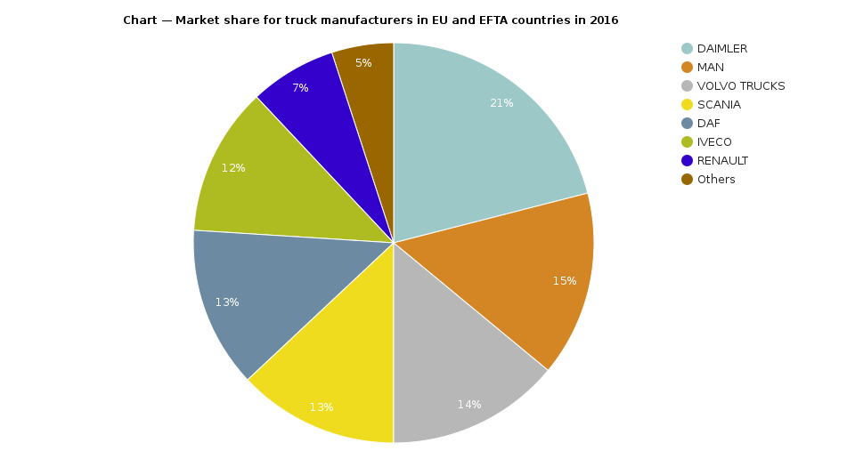
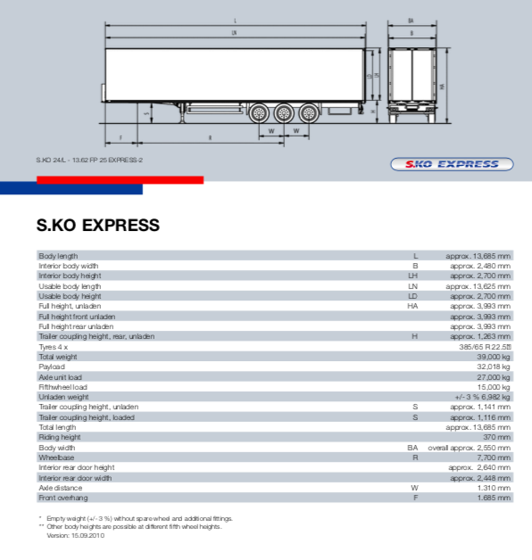
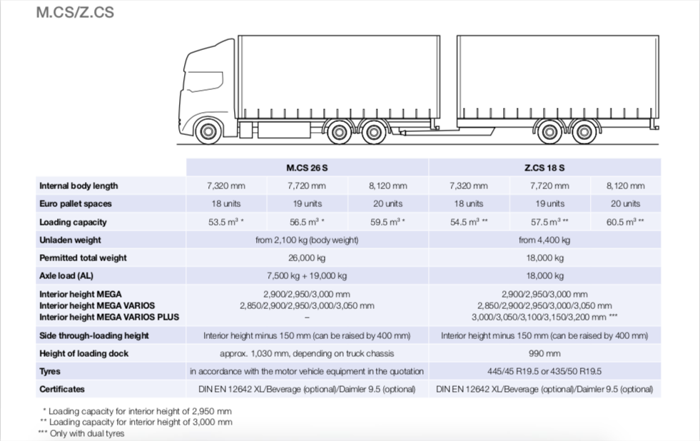

# Research types of Trucks
This file contains information about 3 different truck models, these models will  be parameters in the web-app and the goal is to let the user of this applet adjust between different trucks.
This should provide the user with different results based on the different models of the trucks used as parameter.
This is because we expect different models to have differing maximal loads (depending of good sizes and weight).

## General information
### Trucks (light & heavy duty)
The truck manufacture with the greatest market share is DAIMLER.
About 21% of trucks on the roads in Europe are manufactured by DAIMLER.
([Source](https://www.eea.europa.eu/data-and-maps/daviz/hdv-market-share-for-vehicle#tab-chart_1))

With regards to light duty trucks in the EU there is even more statistics available.
According to the paper "European vehicle market statistics" the most used model of light duty truck is the Ford Transit.
The Ford Transit alone accounts for about 12.5% of the light-commercial vehicle models on the roads in Europe.

### Trailers
The European union has set regulations on trailers, these regulations restrict the weight & lengths.
The goal of the regulations is ensure equal access to the road network and fair competition between in the transport industry.
In the EU the maximal Gross vehicle weight (GVW) of tractors is limited to 40 tonnes in comparison the maximal GVW in the US this is 36.3 tonnes.
(Source: Market analysis of heavy-duty commercial trailers in Europe)

> The gross vehicle weight rating (GVWR), or gross vehicle mass (GVM) is the maximum operating weight/mass of a vehicle 
> as specified by the manufacturer including the vehicle's chassis, body, engine, engine fluids, fuel, accessories, 
> driver, passengers and cargo but excluding that of any trailers. The term is used for motor vehicles and trains.
> 
> -- ([Wikipedia, the free encyclopedia](https://en.wikipedia.org/wiki/Gross_vehicle_weight_rating)) 

The European defines 2 different max lengths of trailers. 
The limit is 13.6m for box semi-trailers, and for road trains the limit is 18.75 (A road train is a truck with a series of trailers attached to it).
Other European countries such as Finland, Iceland, Norway, or Sweden allow for longer trailers and road trains, this is achieved by combining different models together to make longer ones.
(Source: Market analysis of heavy-duty commercial trailers in Europe)

The largest producer of semitrailers in Europe is Schmitz Cargobull in 2011 their market share stabilized around 26% of the total market share.
(Source: Market analysis of heavy-duty commercial trailers in Europe)

## Truck A - Ford Transit 2020
### Engine
There are two engines that the ford transit uses comes with the first is the PDFI and the second is EcoBoost.

| *Engine type*    | *Displacement* (cu. In../ ml) | *Horsepower* (SAE net @ RPM) | *Torque* (lb.-ft. @ RPM) | *Compression ratio* | *Bore x stroke* (in.) | *Valvetrain*               | *Fuel delivery*                               | *Transmission type*                           |
|------------------|-------------------------------|------------------------------|--------------------------|---------------------|-----------------------|----------------------------|-----------------------------------------------|-----------------------------------------------|
| 3.5L PDFI V6     | 213/3497                      | 275 @ 6,500                  | 262 @ 3750               | 11.8.1              | 3.64 x 3.41           | DOHC, 4 valve per cylinder | Sequential multiport electronic               | 10-speed automatic Selectshift with overdrive |
| 3.5L EcoBoost V6 | 213/3497                      | 310 @ 5,000                  | 400 @ 2,500              | 10.0:1              | 3.64 x 3.41           | DOHC, 4 valve per cylinder | Direct gasoline injection, dual turbochargers | 10-speed automatic Selectshift with overdrive |

### Volume
The maximum cargo volume for a regular length and medium height Ford Transit is 315.2 cubic feet.

| *Length* | *Roof* | *Seating* | *Cargo Volume* (cu. ft) | *Cargo Volume* no passenger seat (cu. ft) |
|----------|--------|-----------|-------------------------|-------------------------------------------|
| Regular  | Low    | 2         | 246.7                   | 285                                       |
| Regular  | Medium | 2         | 315.2                   | 363.8                                     |
| Long     | Low    | 2         | 277.7                   | 316.1                                     |
| Long     | Medium | 2         | 357.1                   | 405.6                                     |
| Long     | High   | 2         | 404.3                   | 459.2                                     |
| Long-El  | High   | 2         | 425.4                   | 542.2                                     |

### Max Payload
The maximum GVWR of the Ford Transit 2020 is 10,360 Ibs.
There are more specific payloads for different models on the ford website however the table is very big so will not be included here.
([Source](https://www.ford.com/commercial-trucks/transit-cargo-van/models/transit-van/))

## Truck B - Daimler ???
### Engine
??? This may not be needed, it is hard to find the most popular truck model in Europe.
Could just be a waste of time. ???

## Trailer 1 - Schmitz Cargobull S.KO Express

### Volume
The volume is equal to: height * width * length = LH * B * LN (using diagram about) = 2.700m * 2.480m * 13.625m = 91.233 cubic meters

### Max Payload
The payload of the trailer is 32,018 kg.

## Trailer 2 - Schmitz Cargobull M.CS/Z.CS Trailer Combination

### Volume
The volume of the trailers is 2 * 56.5 = 113 cubic meters for M.CS and 2 * 57.5 = 115 for the Z.CS

### Max Payload
The max payload is 26,000kg * 2 = 52,000 kg for M.CS and 18,000 kg * 2 = 36,000 kg for the Z.CS .
However we need to take EU regulations into account, which limit the GVW to 40 tonnes or 40,000 kg.
This means the payload is limited to 40,000kg - 2 * 2,100kg - Truck_weight = 35800kg - Truck_weight

## Conclusion
From this research it appears that we have enough statistics to develop a simulation of 3 types of truck models.
The first being the Truck A on it's own since it is a light duty truck hence the trailer is self contained.
The second being a combination of Truck B with Trailer 1, representing common a heavy duty truck.
Lastly the third model will be a combination of Truck B with Trailer 2, representing a common heavy duty train truck.
We hope that this combination will accurately simulate what goes on in the real world since we have chosen combination that we expect are the most common in the real world (EU) based on brand popularity.

## Sources 
- White paper "European vehicle market statistics"
- White paper "Market analysis of heavy-duty commercial trailers in Europe"
- https://www.eea.europa.eu/data-and-maps/daviz/hdv-market-share-for-vehicle#tab-chart_1
- https://www.irmi.com/term/insurance-definitions/gross-combination-weight
- https://en.wikipedia.org/wiki/Gross_vehicle_weight_rating#cite_note-49CFR571.3-1
- https://ec.europa.eu/transport/sites/transport/files/modes/road/events/doc/2009_06_24/2009_gigaliners_workshop_acea.pdf
- https://www.cargobull.com/en/curtainsider-truck-with-central-axle-trailer_260_201.html
- https://www.cargobull.com/en/Semitrailers-S.KO-Express-Box_257_209.html
- https://www.ford.com/commercial-trucks/transit-cargo-van/models/transit-van/